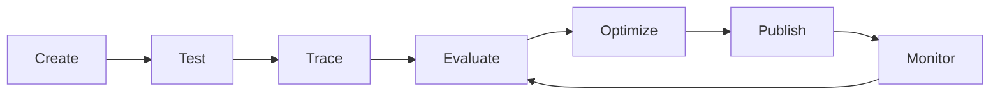

# Chapter 5: Azure AI Foundry Agent Service Development Lifecycle

This chapter covers the complete development lifecycle for building agents with Azure AI Foundry Agent Service.

## Agent Service Lifecycle



### Stage Overview

| Stage | Description | Tools |
|-------|-------------|-------|
| **Create** | Define agent, tools, and knowledge sources | Azure AI Foundry Playground, SDK |
| **Test** | Interactive testing in Playground | Playground chat interface |
| **Trace** | End-to-end observability with Application Insights | Application Insights, OpenTelemetry |
| **Evaluate** | Quality and safety metrics | AI Evaluation SDK, custom evaluators |
| **Optimize** | Improve prompts, tools, and grounding | Prompt engineering, RAG tuning |
| **Publish** | Deploy to production endpoint | Managed online endpoint |
| **Monitor** | Production observability and alerting | Application Insights, Azure Monitor |

---

## Step-by-Step: Azure Playground to Local Code

### 1. Create Agent in Azure Playground

**Important**: This chapter uses the **traditional Assistants API** (via `azure-ai-agents` SDK) which requires an `asst_` ID. The Playground's **Agents** tab creates new-style Agents (UUID IDs) which are incompatible.

**To get an `asst_` ID, create an Assistant (not Agent) via Azure Portal:**

1. Go to [Azure Portal](https://portal.azure.com/) → your **Azure AI Foundry resource**
2. Navigate to **AI Foundry** → **Assistants** (or **Model catalog** → **Assistants**)
3. Click **Create** → **Assistant**
4. Configure:
   - **Name**: `rag-chat-agent`
   - **Model**: `gpt-4o` (or your deployed model)
   - **Instructions**: Copy from [agent_instructions.md](agent_instructions.md)
   - **Tools**: Enable **Code Interpreter**, **File Search**
   - **Files**: Upload files from `sample_documents/` folder
5. **Copy the Assistant ID** (format: `asst_AbCdEfGh1234...`)
6. Add to `.env`: `AGENT_ID=asst_AbCdEfGh1234...`

> **Alternative**: If Assistants isn't visible in Portal, use the REST API:
> ```bash
> # List assistants
> az rest --method get --url "https://<resource>.services.ai.azure.com/api/projects/<project>/assistants?api-version=v1"
> 
> # Create assistant (POST with JSON body)
> ```

---

### 1b. (Optional) Create Agent in Playground for Testing Only

1. Navigate to [Azure AI Foundry Playground](https://ai.azure.com/)
2. Create or select a project
3. Go to **Agents** → **Create agent**
4. Configure:
   - **Name**: `rag-chat-agent`
   - **Model**: `gpt-4o` (or your deployed model)
   - **Instructions**: See [agent_instructions.md](agent_instructions.md)
   - **Tools**: Enable **Code Interpreter**, **File Search**
     - *Note: Function Calling is not a UI toggle in Playground. Define functions via SDK/API (see [mcp_server.py](mcp_server.py) for custom tool definitions)*
   - **Knowledge**: Add your data source:
     - **Option A — File Search (easiest for Playground)**:
       1. In Playground, click **Add files** under Knowledge
       2. Upload PDF/MD/TXT files (e.g., HR policies, IT guidelines, API docs)
       3. Files are automatically indexed for vector search
     - **Option B — Azure AI Search Index (production)**:
       1. Create an Azure AI Search resource
       2. Create an index with your documents
       3. In Playground, select **Azure AI Search** and connect your index
     - **Option C — Blob Storage (for large datasets)**:
       1. Upload documents to Azure Blob Storage container
       2. Create an AI Search indexer pointing to the blob container
       3. Connect the index in Playground

    **For quick testing**: Use **Option A** — just drag & drop PDF/Markdown files directly in Playground.

> ✅ **Playground accepts `.md`, `.pdf`, `.txt`, `.docx` files directly** — no conversion needed!
> Upload the files from `sample_documents/` folder:
> - `HR_Employee_Handbook_2024.md` — Vacation, leave, benefits policies
> - `IT_Security_Policies_v3.1.md` — Data classification, approved tools, incident response
> - `API_Documentation_v2.3.md` — Internal REST/gRPC APIs, auth, rate limits

### 2. Test in Playground

1. Open the agent in **Playground**
2. Test queries:
   - "What is the refund policy?"
   - "Find documentation on API authentication"
   - "Summarize the quarterly report"
3. Verify citations and grounding
4. **Copy Agent ID** for local integration:
   - In Playground, click the agent name → **Copy ID** (format: `asst_...`)
   - Add to `.env` as `AGENT_ID=asst_...`

### 3. Set Up Local Development

**All configuration is in the root `.env` file** (same pattern as Chapters 1-4). The scripts auto-load it via `load_dotenv(find_dotenv())`.

```bash
# Install dependencies
pip install -r requirements.txt
```

**Required `.env` variables for Chapter 5:**

| Variable | Where to Find in Azure AI Foundry | Example |
|----------|-----------------------------------|---------|
| `PROJECT_ENDPOINT` (or `AZURE_AI_PROJECT_ENDPOINT`) | **Project → Overview → Endpoint** | `https://my-resource.services.ai.azure.com/api/projects/my-project` |
| `AGENT_ID` | **Agents → Select Agent → Copy ID** (format: `asst_abc123...`) | `asst_AbCdEfGh1234...` |
| `APPLICATIONINSIGHTS_CONNECTION_STRING` | **Azure Portal → Application Insights → Overview → Connection String** | `InstrumentationKey=...;IngestionEndpoint=https://...` |

**Optional (already in .env from other chapters):**
| Variable | Where to Find |
|----------|---------------|
| `AZURE_OPENAI_ENDPOINT` | Project → Overview → Endpoint (OpenAI format) |
| `AZURE_OPENAI_DEPLOYMENT_NAME` | Models + endpoints → Deployment name |

> 💡 The `.env` file already contains `AZURE_AI_PROJECT_ENDPOINT` from earlier chapters. `PROJECT_ENDPOINT` falls back to it automatically.

### 4. Wire Local Code to Playground Agent

See [mcp_server.py](mcp_server.py) for a complete implementation with:
- Agent invocation with tracing
- Application Insights integration
- Evaluation hooks
- Custom tool definitions

### 5. Run Local Agent

```bash
python mcp_server.py
```

### 6. View Traces in Application Insights

1. Open Application Insights in Azure Portal
2. Go to **Transaction search** or **Application Map**
3. Filter by `cloud_RoleName = "rag-chat-agent"`
4. Inspect end-to-end traces including tool calls

---

## Practical RAG Chat Scenario

### Use Case: Enterprise Policy Assistant

**Data Sources:**
- HR policies (PDF)
- IT security guidelines (Markdown)
- API documentation (OpenAPI specs)

**Agent Capabilities:**
- Answer policy questions with citations
- Search across multiple document types
- Execute code for calculations (e.g., leave balance)
- Call external APIs for real-time data

**Evaluation Metrics:**
- Groundedness: % answers with valid citations
- Relevance: User satisfaction score
- Safety: Blocked harmful content rate
- Latency: P95 response time < 3s

---

## Implementation Files

| File | Description |
|------|-------------|
| `mcp_server.py` | Azure-connected agent server (requires Azure setup) |
| `local_mcp_server.py` | **Local-only agent server (no Azure, uses Ollama + ChromaDB)** |
| `agent_instructions.md` | System prompt for the agent (shared) |
| `evaluators.py` | Custom evaluation functions (shared) |
| `requirements.txt` | Azure version dependencies |
| `requirements_local.txt` | Local version dependencies |
| `sample_documents/` | Knowledge base files (shared) |
| `tools/` | Custom tool implementations |
| `tests/` | Unit and integration tests |

---

## Next Steps

1. **Deploy to production**: Create managed online endpoint
2. **Set up CI/CD**: GitHub Actions for automated testing
3. **Configure alerts**: Latency, error rate, groundedness thresholds
4. **Continuous evaluation**: Scheduled batch evaluations

---

## 🏠 Local Development: Run Everything Offline (No Azure)

Since the Azure Agent Service SDK is in transition and the traditional Assistants API is retired, you can run a **fully local version** that mimics the Azure architecture. This lets you develop, test, and evaluate agents without Azure costs or connectivity.

### Local Architecture Correlation

| Azure AI Foundry Component | Local Equivalent (`local_mcp_server.py`) | Why It Matters |
|---------------------------|------------------------------------------|----------------|
| **Azure OpenAI / Model Deployment** | **Ollama** (local LLM: `llama3.2`, `mistral`, etc.) | Run models locally, no API costs, full privacy |
| **AI Search / Vector Store** | **ChromaDB** (local vector database) | Persistent local embeddings, same RAG pattern |
| **Agent Service (Playground Agent)** | **LocalRAGChatAgent** class | Same interface: `chat()`, citations, tools |
| **Application Insights** | **LocalTracer** (JSONL file + console) | Same span structure, works offline |
| **Azure AI Evaluation SDK** | **evaluators.py** (identical) | Exact same groundedness/relevance/safety metrics |
| **Agent Instructions** | **agent_instructions.md** (identical) | Portable system prompt |
| **Sample Documents** | **sample_documents/** (identical) | Same knowledge base |
| **Custom Tools** | **custom_functions** (identical) | Same function calling pattern |

### Why This Architecture?

```
┌─────────────────────────────────────────────────────────────────┐
│                    AZURE (Production)                           │
├─────────────────────────────────────────────────────────────────┤
│  Playground Agent → AI Search → OpenAI Model → App Insights    │
└─────────────────────────────────────────────────────────────────┘
                              │
                              ▼ (Same patterns, local alternatives)
┌─────────────────────────────────────────────────────────────────┐
│                    LOCAL (Development)                          │
├─────────────────────────────────────────────────────────────────┤
│  LocalRAGChatAgent → ChromaDB → Ollama Model → JSONL Traces    │
└─────────────────────────────────────────────────────────────────┘
```

**Benefits of Local-First Development:**
- ✅ **Zero Azure costs** during development
- ✅ **No network dependency** - works offline/airplane mode
- ✅ **Instant iteration** - no deployment waits
- ✅ **Full privacy** - data never leaves machine
- ✅ **Same evaluation** - groundedness/relevance/safety metrics identical
- ✅ **Portable skills** - patterns transfer directly to Azure

### Quick Start: Local MCP Server

```bash
# 1. Install Ollama (one-time)
# macOS: brew install ollama
# Linux: curl -fsSL https://ollama.ai/install.sh | sh
# Windows: Download from ollama.ai

# 2. Start Ollama and pull a model
ollama serve &
ollama pull llama3.2

# 3. Install Python dependencies
pip install -r requirements_local.txt

# 4. Run local server
python local_mcp_server.py
```

### Local Requirements (`requirements_local.txt`)

```text
# Local LLM & Vector DB
ollama>=0.6.3
chromadb>=1.5.9
sentence-transformers>=2.2.0

# Shared with Azure version
python-dotenv>=1.0.0

# Evaluation (same as Azure)
pytest>=8.0.0
pytest-asyncio>=0.23.0
```

### What Works Locally vs Azure

| Feature | Local | Azure |
|---------|-------|-------|
| Chat with citations | ✅ | ✅ |
| Vector search (RAG) | ✅ | ✅ |
| Groundedness evaluation | ✅ | ✅ |
| Relevance evaluation | ✅ | ✅ |
| Safety evaluation | ✅ | ✅ |
| Custom tools (functions) | ✅ | ✅ |
| Tracing/observability | ✅ (JSONL) | ✅ (App Insights) |
| File Search tool | ✅ (ChromaDB) | ✅ (AI Search) |
| Code Interpreter | ❌ (use functions) | ✅ |
| Managed scaling | ❌ | ✅ |
| Enterprise auth | ❌ | ✅ |
| Production monitoring | ❌ | ✅ |

### Migration Path: Local → Azure

When ready for production, the migration is straightforward:

1. **Swap model client**: Ollama → Azure OpenAI / Model Deployment
2. **Swap vector store**: ChromaDB → Azure AI Search
3. **Swap tracing**: JSONL → Application Insights
4. **Keep everything else**: Same agent class, same evaluations, same tools, same instructions

The `local_mcp_server.py` and `mcp_server.py` share the **exact same**:
- `AgentInteraction` dataclass
- `EvaluationHooks` / `LocalEvaluationHooks` (same logic)
- `evaluators.py` (identical)
- `agent_instructions.md` (identical)
- `custom_functions` (identical)

### Test Queries (Same as Azure Playground)

```bash
You: What is the refund policy?
You: Find documentation on API authentication
You: Summarize the quarterly report
```

Expected behavior mirrors Azure:
- **Refund policy** → Admits uncertainty (not in docs)
- **API authentication** → Cites `API_Documentation_v2.3.md`
- **Quarterly report** → Admits uncertainty, lists available docs