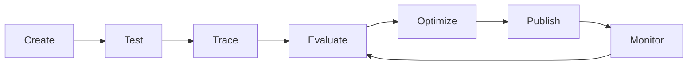

# Chapter 5: Azure AI Foundry Agent Service Development Lifecycle

This chapter covers the complete development lifecycle for building agents with Azure AI Foundry Agent Service.

## Agent Service Lifecycle



### Stage Overview

| Stage | Description | Tools |
|-------|-------------|-------|
| **Create** | Define agent, tools, and knowledge sources | Azure AI Foundry Playground, SDK |
| **Test** | Interactive testing in Playground | Playground chat interface |
| **Trace** | End-to-end observability with Application Insights | Application Insights, OpenTelemetry |
| **Evaluate** | Quality and safety metrics | AI Evaluation SDK, custom evaluators |
| **Optimize** | Improve prompts, tools, and grounding | Prompt engineering, RAG tuning |
| **Publish** | Deploy to production endpoint | Managed online endpoint |
| **Monitor** | Production observability and alerting | Application Insights, Azure Monitor |

---

## Step-by-Step: Azure Playground to Local Code

### 1. Create Agent in Azure Playground

1. Navigate to [Azure AI Foundry Playground](https://ai.azure.com/)
2. Create or select a project
3. Go to **Agents** → **Create agent**
4. Configure:
   - **Name**: `rag-chat-agent`
   - **Model**: `gpt-4o` (or your deployed model)
   - **Instructions**: See [agent_instructions.md](agent_instructions.md)
   - **Tools**: Enable **Code Interpreter**, **File Search**, **Function Calling**
   - **Knowledge**: Add your data source (Azure AI Search index, blob storage, etc.)

### 2. Test in Playground

1. Open the agent in **Playground**
2. Test queries:
   - "What is the refund policy?"
   - "Find documentation on API authentication"
   - "Summarize the quarterly report"
3. Verify citations and grounding
4. Export **Agent ID** for local integration

### 3. Set Up Local Development

```bash
# Install dependencies
pip install azure-ai-projects azure-identity opentelemetry-api opentelemetry-sdk opentelemetry-exporter-azuremonitor azure-monitor-opentelemetry

# Set environment variables
export PROJECT_ENDPOINT="https://<your-project>.services.ai.azure.com/api/projects/<project-name>"
export AGENT_ID="<agent-id-from-playground>"
export APPLICATIONINSIGHTS_CONNECTION_STRING="<from-application-insights>"
```

### 4. Wire Local Code to Playground Agent

See [mcp_server.py](mcp_server.py) for a complete implementation with:
- Agent invocation with tracing
- Application Insights integration
- Evaluation hooks
- Custom tool definitions

### 5. Run Local Agent

```bash
python mcp_server.py
```

### 6. View Traces in Application Insights

1. Open Application Insights in Azure Portal
2. Go to **Transaction search** or **Application Map**
3. Filter by `cloud_RoleName = "rag-chat-agent"`
4. Inspect end-to-end traces including tool calls

---

## Practical RAG Chat Scenario

### Use Case: Enterprise Policy Assistant

**Data Sources:**
- HR policies (PDF)
- IT security guidelines (Markdown)
- API documentation (OpenAPI specs)

**Agent Capabilities:**
- Answer policy questions with citations
- Search across multiple document types
- Execute code for calculations (e.g., leave balance)
- Call external APIs for real-time data

**Evaluation Metrics:**
- Groundedness: % answers with valid citations
- Relevance: User satisfaction score
- Safety: Blocked harmful content rate
- Latency: P95 response time < 3s

---

## Implementation Files

| File | Description |
|------|-------------|
| `mcp_server.py` | Main agent server with tracing and evaluation |
| `agent_instructions.md` | System prompt for the agent |
| `evaluators.py` | Custom evaluation functions |
| `tools/` | Custom tool implementations |
| `tests/` | Unit and integration tests |

---

## Next Steps

1. **Deploy to production**: Create managed online endpoint
2. **Set up CI/CD**: GitHub Actions for automated testing
3. **Configure alerts**: Latency, error rate, groundedness thresholds
4. **Continuous evaluation**: Scheduled batch evaluations